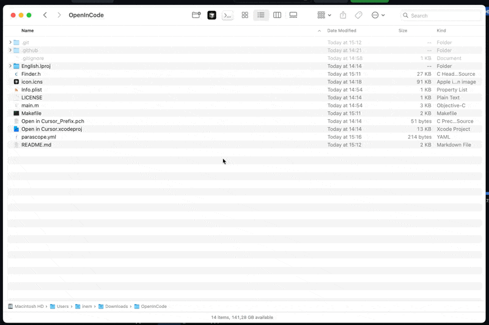
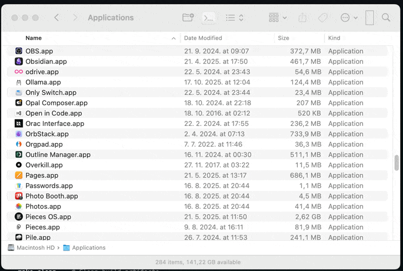

# OpenInCursor
:open_file_folder: Finder toolbar app to open current folder in Cursor



## Installation and usage:

### Install via Homebrew (Recommended)

```bash
brew tap inem/open-in-cursor
brew install --cask open-in-cursor
```

### Manual Installation

1. **Download the app** from [Releases](https://github.com/inem/OpenInCursor/releases) (pre-built app)
   - Or download from [GitHub Actions](https://github.com/inem/OpenInCursor/actions) artifacts (latest build)

2. **Handle Gatekeeper warning** (macOS security):
   - **Method 1 (Recommended)**: Right-click the downloaded app → **"Open"** (don't double-click)
     - Then click **"Open"** again in the security dialog
   - **Method 2**: Open Terminal and run:
     ```bash
     sudo xattr -rd com.apple.quarantine "/path/to/Open in Cursor.app"
     ```

3. **Move app to Applications**:
   ```bash
   mv ~/Downloads/"Open in Cursor.app" /Applications/
   ```

4. **Add to Finder toolbar**:
   - Open `/Applications` folder
   - Hold **Command** key and drag `Open in Cursor.app` to Finder toolbar

5. **First time setup**:
   - Right-click the toolbar icon → **"Open"**
   - Allow the app to run in System Settings if prompted

## Usage

**After installation:**
   - Navigate to any folder in Finder
   - Click the toolbar icon
   - Folder will open in Cursor

## Build from source:

### Option 1: Using Makefile (Recommended)

```bash
git clone https://github.com/inem/OpenInCursor.git
cd OpenInCursor
make install  # Builds and installs to /Applications
```

Or step by step:
```bash
make          # Build the app
make install  # Install to /Applications
make clean    # Clean build artifacts
```

### Option 2: Using Xcode

```bash
git clone https://github.com/inem/OpenInCursor.git
cd OpenInCursor
open "Open in Cursor.xcodeproj"
# Build in Xcode (Cmd+B)
# App will be in: ~/Library/Developer/Xcode/DerivedData/.../Build/Products/Release/
```

## Installation Demo



> 💡 **Note**: Make sure to press and hold **⌘ Command** button while dragging App to toolbar
